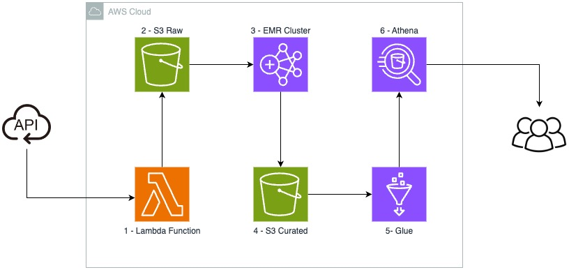

# Caso de evolução de dados de uma API

O estudo de caso mostrado consiste na coleta e evolução de dados de uma API utilizando serviços da AWS. Alguns requisitos importantes como periodicidade e volumetria ficaram em aberto, logo vou montar uma arquitetura base e mencionar as possíveis alterações para cada um dos casos.

## 1 - Lambda Function

Para a etapa de coleta preliminar dos dados foi escolhido uma função Lambda. Esse serviço é altamente personalizável e serveless, ou seja, é possível realizar a operação de coleta e escrita dos dados no S3 na camada Raw em qualquer periodicidade necessária pois possui naturalmente um trigger para fácil ajuste.

O fato de ser um serviço serverless auxilia no quesito de não ser necessário configurar uma máquina para essa etapa.

Alguns problemas podem ser acarretados com a utilização da Lambda: execuções com mais de 15 minutos são um problema, ou seja, caso a API seja muito lenta é necessário criar uma estrutura para retry em fila e trigar a execução novamente. Realizar uma quantidade muito grande de chamadas pode acarretar em um aumento substancial de custo, então isso deve ser realizado e pensado com cautela.

Caso seja necessário por uma questão de volumetria acentuada é possível subtituir a Lambda por um cluster EMR que consegue realizar a chamada API e paralelizar a escrita dos dados, porém ao custo de ser mais caro por serem N máquina dedicadas.

Um exemplo de código para a Lambda pode ser encontrado no arquivo [lambda_function.py](./lambda_function.py)

## 2 - S3 Raw

Realizar a carga de dados crua em um S3 é uma solução barata e eficiente. O custo de armazenamento é muito em conta e utilizando o Intelligent-Tiering o custo fica ainda menor com o tempo. 

Ao realizar essa carga de dados é possível realizar processamento e reprocessamento sempre que necessário, sem processar a coleta novamente. Dessa forma também é possível mantem uma linhagem de dados concisa e consistente.

Ao salvar os dados particionados por data é possível realizar a leitura de forma mais eficiente e rápida, além de ser possível realizar a leitura de forma incremental.

## 3 - EMR Cluster

Nesse caso o cluster EMR faz sentido para um tipo de processamento mais complexo, como o que foi mencionado na questão 3 do teste. É possível alocar um cluster com uma única master e permitir que os nós sejam adicionados e removidos de forma dinâmica, o que permite que o cluster seja dimensionado de acordo com a necessidade de processamento.

Nessa etapa é possível escrever o dado em um formato mais eficiente como parquet. Além disso, é possível realizar o processamento de forma paralela e distribuída, o que permite que o processamento seja realizado de forma mais rápida. Nessa etapa escrever o dado com o mesmo schema da leitura ou normalizar as tabelas são opções válidas, dependendo do caso de uso.

Nesse caso é necessário um atuar externo para realizar o trigger do cluster, o que pode ser feito com uma Lambda ou um serviço de orquestração como o Airflow.

## 4 - S3 Curated

Nessa etapa o dado se encontra em um formato mais eficiente e pronto para ser consumido. É possível realizar a leitura de forma incremental e realizar o processamento de forma mais rápida se necessário. 

É importante frisar o que o estilo de particionamento deve ser pensado de acordo com o caso de uso, pois pode ser que seja necessário realizar a leitura de forma mais rápida ou que seja necessário realizar a leitura de forma mais eficiente.

Dessa forma, é possível adicionar uma outra camada de armazenamento como um S3 Analytics para escrever o dado no formato mais eficiente para o caso de uso. Lembrando que o custo de armazenamento é barato, porém o custo de scan é alto, então é importante pensar em como o dado será lido.

Usar estruturas como o Delta podem ajudar dependendo dos requisitos de escrita e leitura.

## 5 - Glue Catalog

Realiza o catálogo de dados permite manter uma estrutura consisa e um contrato de esquemas bem definido. Dessa forma realizar a leitura e exploração dos dados é mais fácil e intuitivo.

O catálogo de metadados permite que as leituras sejam realizadas de forma mais inteligente utilizando a ideia de particionamento das tabelas Hive.

## 6 - Athena

Para o caso do consumo foi optado pelo Athena que permite que o usuário utilize as tabelas catalogas no Glue como forma de consumo dos dados. Seu custo é por scan de dados ou por tempo de DPU utilizado. Então nesse caso, entender o perfil de consumo das queries é importante para entender qual o melhor custo benefício.

Caso a utilização de queries seja em um volume muito alto e um processamento massivo é possível optar por utilizar o Redshift Spectrum que permite ler os dados do S3. Ou utilizar uma instância do Redshift com um copy dos dados do S3. Lembrando que esse serviço pode ser mais caro que o Athena.